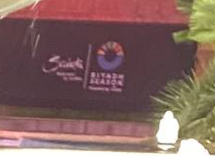
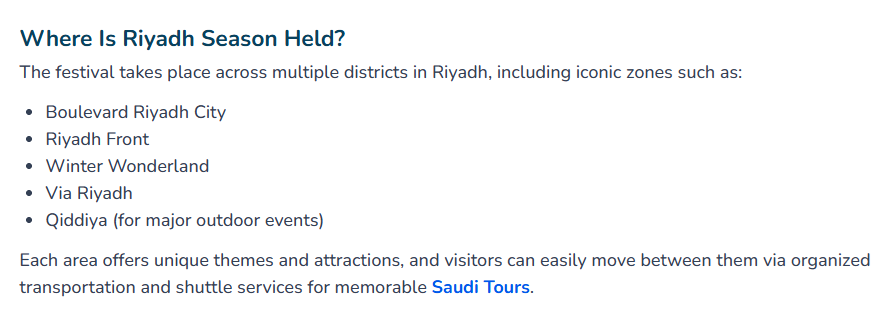
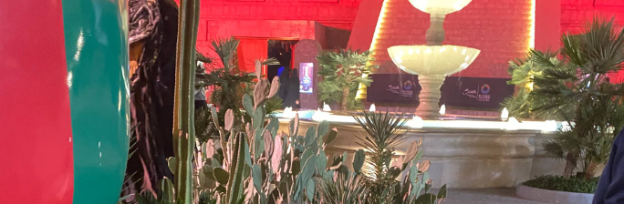

# WanaGames CTF WriteUp

 

## Misc - Wanderer's Snapshot

### Challenge Overview

**Type:** Misc  
**Difficulty:** Ezpz 

---

### Description

In this challenge, you are given an image and need to identify a specific location based on visual clues. The image contains a cactus with a unique shape, but don't be deceived by obvious details. **bro look at the cactus , very sussy**

### Challenge Image

### Solution Steps

####  Analyze the Image

When you examine the image closely, zoom in on the background. There are several clues hidden in the scene:

- **Main clue:** The unique cactus shape
- **Background details:** Look for landmarks or distinctive features
- **Context clues:** Environmental indicators

####  Clue 1

- This location correlates with **Riyadh Season**, an annual event held in Saudi Arabia
- The landscape and architecture suggest a Middle Eastern location

#### Gather Additional Information

**findings:**
- The event location is linked to Riyadh, Saudi Arabia
- The unique cactus species and environmental features narrow down the exact spot
- Cross-reference with event venue locations

####  Clue 2

there is a pyramid at the background of the image.
by comparing infomation from **Riyadh Season** event, the only place that has pyramid is **boulevard world**

#### boom the flag

## Forensic - knock-knock